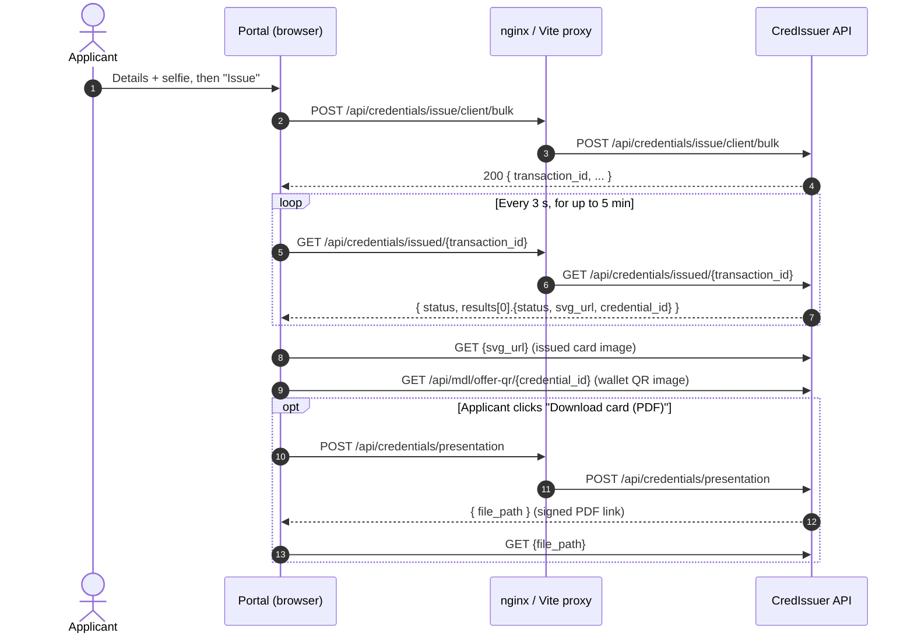

# Issuance engine integration

Out of the box, the Digital ID portal issues credentials through **CredIssuer**. This guide first explains exactly how the portal uses CredIssuer: the API calls, the payload and the configuration. It then covers what an issuance engine must provide, and what code to change, if you want to use your own engine instead.

The portal is a static single-page app with no backend of its own. Every issuance call goes from the browser through a reverse proxy to the issuance engine. The request format and the configuration settings follow CredIssuer's API, so connecting a different engine always takes some work. See [Using your own issuance engine](#using-your-own-issuance-engine).

- [How issuance works today](#how-issuance-works-today)
- [CredIssuer API calls](#credissuer-api-calls)
- [Credential data mapping](#credential-data-mapping)
- [Using your own issuance engine](#using-your-own-issuance-engine)
- [Security considerations](#security-considerations)
- [Testing an integration](#testing-an-integration)

## How issuance works today



1. The applicant completes the three-step wizard: details, selfie, review.
2. On **Issue**, the portal builds the credential payload (see [Credential data mapping](#credential-data-mapping)) and submits a single-record bulk issuance request.
3. CredIssuer accepts the request asynchronously and returns a `transaction_id`.
4. The portal polls the issuance status for that transaction until it completes, fails or times out.
5. Once issuance completes, the portal uses `svg_url` to show the issued card and `credential_id` to show a wallet QR code and offer a PDF download.
6. CredIssuer also emails the credential to the applicant, because the portal requests `mode_of_issuance=issue_and_notify`.

### Where the code lives

| File | Responsibility |
| --- | --- |
| `src/config/apiConfig.ts` | Base path, endpoint paths, polling timings, query parameters, auth headers and URL builders |
| `src/services/credIssuer.ts` | API client: issue, poll status, request PDF; response types; status classification; error parsing |
| `src/hooks/useIssuanceStatusPolling.ts` | Polling loop: interval, timeout, consecutive-error limit, completion and failure callbacks |
| `src/utils/digitalIdCredential.ts` | Builds the `credential_data` record: field mapping, MRZ, photo encoding, fixed values |
| `src/App.tsx` | `handleIssueDigitalId` puts it together and switches between the issuing, success and failed screens |
| `src/components/SuccessScreen.tsx` | Wallet QR, wallet download links, PDF download |
| `src/components/ui/IssuedCard.tsx` | Renders the issued card SVG, cropped into front and back faces |
| `src/components/IssuanceProgress.tsx` | Progress screen copy and CredIssuer branding |
| `nginx.conf`, `vite.config.ts` | Reverse proxy from `/api/credentials` to the upstream API |
| `Dockerfile`, `.env.example` | Build-time configuration |

### Configuration

The portal needs four values from your CredIssuer account, set in `.env.local` or as Docker build arguments:

| Variable | What it is in CredIssuer | Where the portal sends it |
| --- | --- | --- |
| `VITE_ISSUER_API_TOKEN` | API token for the issuing organisation | `Authorization: Bearer <token>` header on every proxied call |
| `VITE_ISSUER_TEMPLATE_ID` | ID of the Digital ID credential template | `credential_template` query parameter and `issuer_credential_template_id` in the body |
| `VITE_ISSUER_ORG_CODE` | Code of the issuing organisation | `issuer_info.org_code` in the body |
| `VITE_ISSUER_EMAIL` | Email address of the issuer account | `issuer_info.email` in the body |

The following are hard-coded in `src/config/apiConfig.ts`:

| Setting | Value |
| --- | --- |
| `baseUrl` | `/api/credentials` |
| `statusPollIntervalMs` | 3000 ms |
| `statusPollTimeoutMs` | 5 minutes |
| `modeOfIssuance` | `issue_and_notify` |

### Why requests go through a proxy

The browser calls the relative path `/api/credentials/...`, and a proxy forwards it to the CredIssuer host. This avoids cross-origin (CORS) restrictions and keeps the upstream host out of the frontend code.

- **Production:** the `location /api/credentials/` block in `nginx.conf`
- **Development:** `server.proxy['/api/credentials']` in `vite.config.ts`

Two kinds of resource bypass the proxy and are loaded straight from CredIssuer by the browser: the wallet offer QR image and the URLs CredIssuer returns (`svg_url`, `file_path`).

## CredIssuer API calls

All proxied calls send `Authorization: Bearer <VITE_ISSUER_API_TOKEN>`.

### 1. Issue credential

```http
POST /api/credentials/issue/client/bulk?credential_template=<template-id>&mode_of_issuance=issue_and_notify
Authorization: Bearer <token>
Content-Type: application/json
```

```json
{
  "issuer_info": {
    "org_code": "<org-code>",
    "email": "<issuer-email>"
  },
  "issuer_credential_template_id": "<template-id>",
  "credential_data": [
    {
      "givenName": "Jane",
      "surName": "Doe",
      "email": "jane@example.com",
      "sex": "Female",
      "nrcNumber": "NIDUT0003",
      "dateOfBirth": "1990-04-12T00:00:00.000Z",
      "dateOfIssue": "2026-10-06T00:00:00.000Z",
      "mrz_line_1": "IDUTONIDUT0003<<<<<<<<<<<<<<<<",
      "mrz_line_2": "9004121F<<<<<<<UTO<<<<<<<<<<<4",
      "nationality": "Utopia",
      "placeOfBirth": "Lusaka",
      "district": "Central",
      "villageName": "Munyumbwe",
      "chief": "Chief Mukuni",
      "photo": [
        {
          "storage": "base64",
          "name": "Jane-photo-<uuid>.jpeg",
          "originalName": "Jane-photo.jpeg",
          "url": "data:image/jpeg;base64,/9j/4AAQ...",
          "size": 48213,
          "type": "image/jpeg",
          "hash": ""
        }
      ]
    }
  ]
}
```

The MRZ lines above are illustrative. The real values are calculated by `buildMrzLines`.

The portal relies on one response field. If `transaction_id` is missing, issuance is treated as failed:

```json
{ "transaction_id": "<transaction-id>", "message": "...", "...": "other fields are typed but unused" }
```

**Code:** `issueDigitalId` in `src/services/credIssuer.ts`, with `buildCredentialIssueUrl` building the URL.

### 2. Poll issuance status

```http
GET /api/credentials/issued/<transaction_id>?offset=0&limit=10
Authorization: Bearer <token>
```

The portal reads only these fields:

```json
{
  "status": "Completed",
  "results": [
    { "status": "...", "svg_url": "https://...", "credential_id": "<credential-id>" }
  ]
}
```

| Condition | Portal behaviour |
| --- | --- |
| `status` (trimmed, case-insensitive) equals `completed`, and `results[0].status` is not a failure | Success. Passes `svg_url` and `credential_id` to the success screen and clears the saved draft |
| `status` is `completed` but `results[0].status` matches the failure pattern | Failed screen, showing the record status and transaction ID |
| `status` matches `/fail\|error\|reject\|cancel/i` | Failed screen, showing the status and transaction ID |
| Any other `status` (for example pending or processing) | Polls again after 3 s |
| HTTP or network error | Retried. Five consecutive errors lead to the failed screen |
| Five minutes pass without a final status | Failed screen asking the applicant to check later with the transaction ID |

**Code:** `fetchIssuanceStatus`, `isCompletedStatus` and `isFailedStatus` in `src/services/credIssuer.ts`, plus `useIssuanceStatusPolling`.

### 3. Get PDF presentation

Called only when the applicant clicks **Download card (PDF)**.

```http
POST /api/credentials/presentation
Authorization: Bearer <token>
Content-Type: application/json

{ "credential_id": "<credential-id>", "presentation_type": "pdf" }
```

The response is `{ "file_path": "<signed URL>" }`. The portal downloads that URL as a blob so the file saves in place. If the host blocks CORS, it opens the URL in a new tab instead.

**Code:** `fetchPresentationPdfUrl` in `src/services/credIssuer.ts`, and `DownloadPdf` in `SuccessScreen.tsx`.

### 4. Wallet offer QR

```http
GET https://<credissuer-host>/api/mdl/offer-qr/<credential_id>
```

This is loaded directly as an ``, without the proxy or auth. Scanning the QR adds the credential to the CredIssuer Wallet app. If the image fails to load, the portal shows a "QR code unavailable" notice with a retry button.

**Code:** `buildOfferQrUrl` in `src/config/apiConfig.ts`, and `WalletQr` in `SuccessScreen.tsx`.

### Issued card image (`svg_url`)

The SVG from the status response appears in the side panel as a flippable card. `IssuedCard.tsx` assumes the CredIssuer template layout: a 451×543 SVG with the front face at `31 23 390 231` and the back at `31 289 390 231`. If the image fails to load, the panel keeps showing the live preview card.

### Error messages

On any non-2xx response, the portal shows the first string it finds in the response body's `message`, `detail` or `error` field. If none of those is present, it shows a generic message with the HTTP status.

## Credential data mapping

| Credential field | Source | Format |
| --- | --- | --- |
| `givenName`, `surName`, `email`, `sex`, `nrcNumber` | Details form | As entered. `sex` is `Male`, `Female` or another value |
| `dateOfBirth` | Details form | `YYYY-MM-DDT00:00:00.000Z` |
| `dateOfIssue` | Browser clock (today) | `YYYY-MM-DDT00:00:00.000Z` |
| `mrz_line_1`, `mrz_line_2` | Calculated | ICAO 9303 TD1, 30 characters each, with check digits. No expiry date |
| `photo[0]` | Selfie, after background removal | JPEG data URL (quality 0.8), with name, size and MIME type |
| `nationality`, `placeOfBirth`, `district`, `villageName`, `chief` | Fixed values in `MOCKED_DETAILS` | Strings |

The field names must match the attributes defined in the credential template on the issuer side.

## Using your own issuance engine

Everything in the sections above is specific to CredIssuer: the endpoint paths, the request body, the status values and the four configuration settings. Your own engine will almost certainly differ, so it needs either an adapter or some code changes.

### The configuration settings are CredIssuer-specific

The four values in `.env.example` exist because CredIssuer's issuance API asks for them. Another engine will probably need different details, for example:

| CredIssuer setting | Typical equivalent in another engine |
| --- | --- |
| `VITE_ISSUER_API_TOKEN` (bearer token) | An API key in a custom header, an OAuth client ID and secret, or mutual TLS |
| `VITE_ISSUER_TEMPLATE_ID` | A credential type, schema ID or credential configuration ID |
| `VITE_ISSUER_ORG_CODE` and `VITE_ISSUER_EMAIL` | An issuer DID or tenant ID, or nothing if the API key already identifies the issuer |

To add, rename or remove a setting, update all of these places together:

1. **`.env.example`:** list the new variables (keep the `VITE_` prefix, or Vite won't expose them).
2. **`src/vite-env.d.ts`:** declare their types on `ImportMetaEnv`.
3. **`src/config/apiConfig.ts`:** update the `APIConfig` interface and the `apiConfig` object that reads `import.meta.env`.
4. **The code that sends them:**
   - `buildCredentialIssueUrl` (query parameters) and `getCredIssuerHeaders` / `getCredIssuerStatusHeaders` (auth) in `apiConfig.ts`
   - the `issuer_info` and template ID in `handleIssueDigitalId` in `src/App.tsx`
5. **`Dockerfile`:** add a matching `ARG` and `ENV` line for each variable.
6. **Your CI or deployment scripts:** pass the new `--build-arg` values.

> **Don't put secrets in `VITE_` variables.** They are copied into the JavaScript that every visitor downloads. If your engine needs a client secret or a private key, keep it on the server side: have the reverse proxy or a small backend add it to the upstream request. See [Security considerations](#security-considerations).

With the configuration sorted out, choose one of two approaches. Option A keeps almost the whole frontend unchanged. Option B changes the frontend to call your engine's API directly.

### Option A: Expose a CredIssuer-compatible API (minimal frontend changes)

Build an adapter service that speaks the contract described above and translates it to your engine. The adapter receives the four CredIssuer values in each request (the bearer token, `credential_template`, `org_code` and `email`). It can map them to your engine's own settings, or ignore them and use its own server-side configuration, which is safer. Then point the proxy at that service:

```nginx
location /api/credentials/ {
    proxy_pass https://your-adapter.example.com/api/credentials/;
    proxy_ssl_server_name on;
    proxy_set_header Host your-adapter.example.com;
}
```

Make the same change in `vite.config.ts` for local development.

Minimum contract the adapter must implement:

| Endpoint | Required |
| --- | --- |
| `POST /issue/client/bulk` | Yes. Accept the payload above and return `{ transaction_id }` |
| `GET /issued/{transaction_id}` | Yes. Return `status`, and when complete, `results[0]` with `credential_id` (and `svg_url` if available) |
| `POST /presentation` | Only if you want the PDF download |

Also do the following:

- Accept, or ignore, the `Authorization: Bearer` header.
- If your engine issues credentials synchronously, return a generated `transaction_id` from the issue call and `"status": "Completed"` on the first poll.
- Change `buildOfferQrUrl` in `src/config/apiConfig.ts`, because the wallet QR URL is absolute and doesn't go through the proxy.

This option is the least risky: apart from the proxy target and the wallet QR URL, the portal, its error handling and its UI stay unchanged.

### Option B: Change the portal to call your engine directly

Work through these files in order.

1. **Proxy target.** Change `proxy_pass` and `Host` in `nginx.conf`, and `target` in `vite.config.ts`. If your API lives under a different path, change `baseUrl` in `apiConfig.ts` and the proxy `location` together.
2. **Endpoints and parameters** in `src/config/apiConfig.ts`:
   - Update `issueEndpoint`, `issuedEndpoint` and `presentationEndpoint`.
   - Update the query parameters in `buildCredentialIssueUrl` (`credential_template`, `mode_of_issuance`) and `buildIssuedCredentialsUrl` (`offset`, `limit`).
   - Update the auth scheme in `getCredIssuerHeaders` and `getCredIssuerStatusHeaders`, for example for an API key header or OAuth.
   - Point `buildOfferQrUrl` at your wallet offer, or remove it.
3. **Request payload** in `src/utils/digitalIdCredential.ts`. Reshape `DigitalIdCredentialData` and `buildDigitalIdCredentialData` to your engine's format: attribute names, date format, photo encoding (inline base64 or an upload) and the MRZ fields. Update or remove `MOCKED_DETAILS`. The `issuer_info` wrapper is built in `handleIssueDigitalId` in `src/App.tsx`.
4. **API client** in `src/services/credIssuer.ts`:
   - Update the `IssuancePayload`, `IssuanceResponse` and `IssuanceStatusResponse` types.
   - Update which response field carries the transaction ID.
   - Update `isCompletedStatus` and `isFailedStatus` to match your status values.
   - Update `extractErrorMessage` if your errors use a different shape.
   - Consider renaming the file to something like `issuer.ts`.
5. **Status lookup.** `useIssuanceStatusPolling` expects `status` and `results[0].{status, svg_url, credential_id}`. Map your response onto these fields inside `fetchIssuanceStatus` so the hook can stay as it is. Tune `statusPollIntervalMs` and `statusPollTimeoutMs` to your engine's typical issuance time.
6. **Success screen** (`SuccessScreen.tsx`). Update or remove the wallet steps, the wallet download link and the wallet QR code. Change the "A copy is in your inbox" message if your engine doesn't email the holder.
7. **Issued card** (`IssuedCard.tsx`). If your card SVG has a different size or layout, update `SVG_WIDTH`, `SVG_HEIGHT`, `FRONT` and `BACK`.
8. **Branding.** Remove the CredIssuer logo and wording from `IssuanceProgress.tsx` and `SuccessScreen.tsx`, the `credissuer` colour in `tailwind.config.js`, and `public/brand/credissuer-logo.svg`.

### How the portal behaves with different engine capabilities

| Your engine... | What happens | What to do |
| --- | --- | --- |
| Issues synchronously and returns the credential at once | Nothing breaks if you return a transaction ID and complete on the first poll | Or skip polling: in `handleIssueDigitalId`, call the success handler directly with `svg_url` and `credential_id` |
| Has no status endpoint but supports webhooks | The portal can't receive webhooks, because it has no backend | Add a small backend that stores webhook results and serves them to the existing poll |
| Returns no card image (`svg_url`) | Success still works. The side panel keeps the live preview card | Nothing required |
| Returns no `credential_id` | Success still works. The PDF button is hidden and the wallet QR shows "QR code unavailable" | Remove the wallet section if it doesn't apply |
| Has no PDF presentation endpoint | The PDF button shows an error when clicked | Remove `DownloadPdf` from `SuccessScreen.tsx` |
| Uses OpenID4VCI credential offers | The current QR is a CredIssuer-specific image URL | Change `WalletQr` to render your `openid-credential-offer://` URI as a QR code |
| Uses a different template or attribute schema | Issuance fails with your engine's validation error, shown on the failed screen | Update the credential data mapping (step 3 of Option B) |
| Takes longer than 5 minutes | The applicant sees a timeout with their transaction ID, even if issuance later succeeds | Increase `statusPollTimeoutMs` |

## Security considerations

- **The API token is visible in the browser.** Vite builds `VITE_ISSUER_API_TOKEN` into the JavaScript bundle, so any visitor can read it. For production, have the proxy add the `Authorization` header (for example through an nginx env template fed from a Kubernetes Secret) or use a small backend-for-frontend. Then remove the token from the frontend.
- **Scope the credential.** Whatever engine you use, give the portal's credential issuance-only rights for the one Digital ID template.
- **Personal data in transit.** The selfie and identity data are sent inline in the JSON body. Use HTTPS end to end, including from the proxy to the upstream.
- **Drafts.** Applicant details and the selfie are saved unencrypted in `localStorage` until the application is submitted or the applicant starts over.

## Testing an integration

1. Copy `.env.example` to `.env.local`, fill in your engine's values and run `npm run dev`.
2. Complete the wizard with test data. In DevTools, open the **Network** tab and check:
   - The issue call returns a transaction ID.
   - The status calls move to a completed status.
   - The card image and QR code load.
3. Check the failure paths:
   - Use an invalid template ID, which should show your engine's error message.
   - Stop the upstream mid-poll, which should fail after five consecutive errors.
   - Reuse an ID number that has already been issued.
4. Click **Download card (PDF)** and confirm that the file saves.
5. Build the Docker image and repeat the test against nginx to confirm the production proxy configuration.
